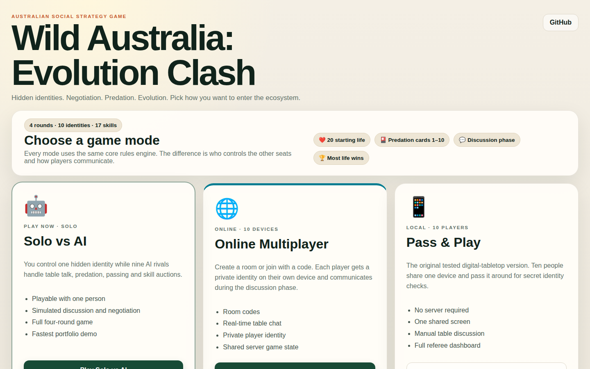
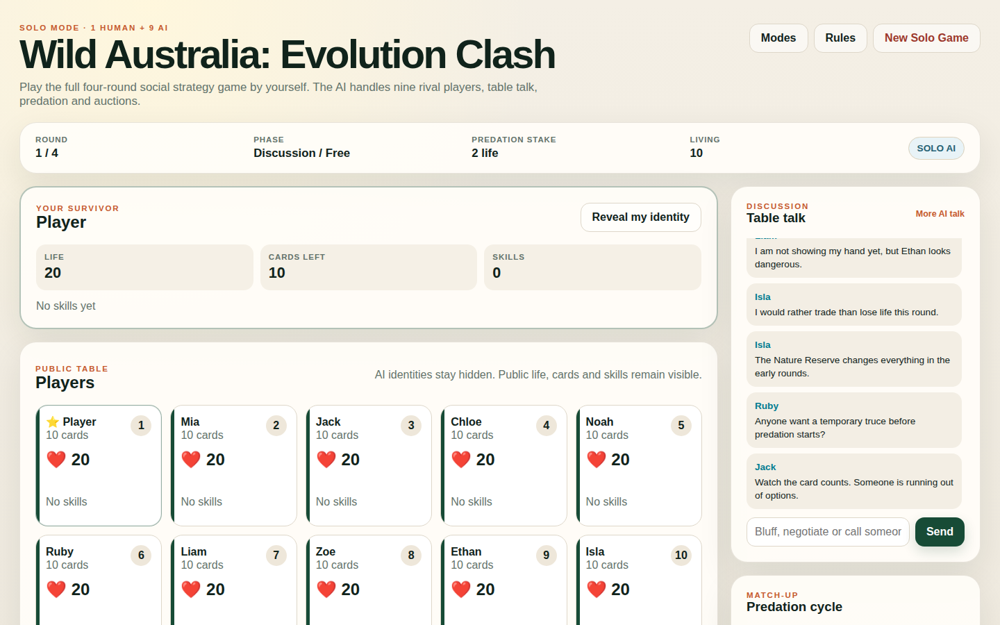
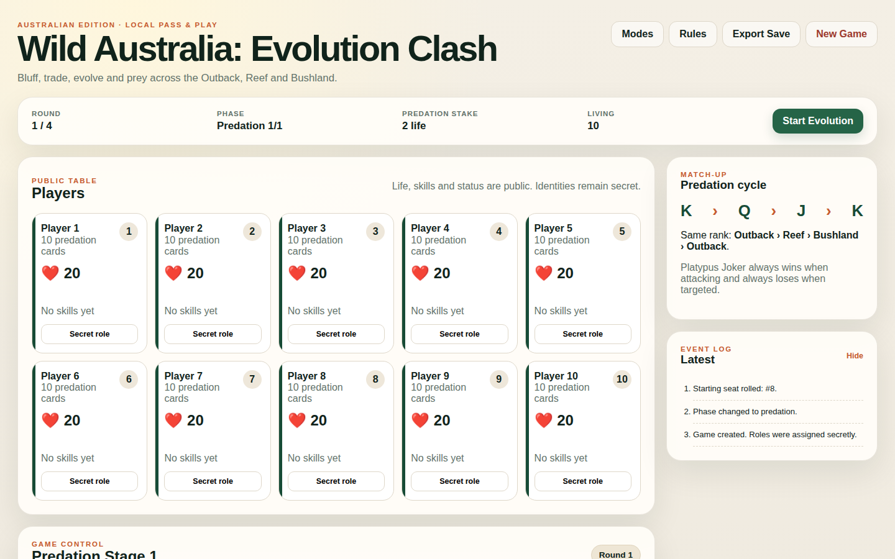
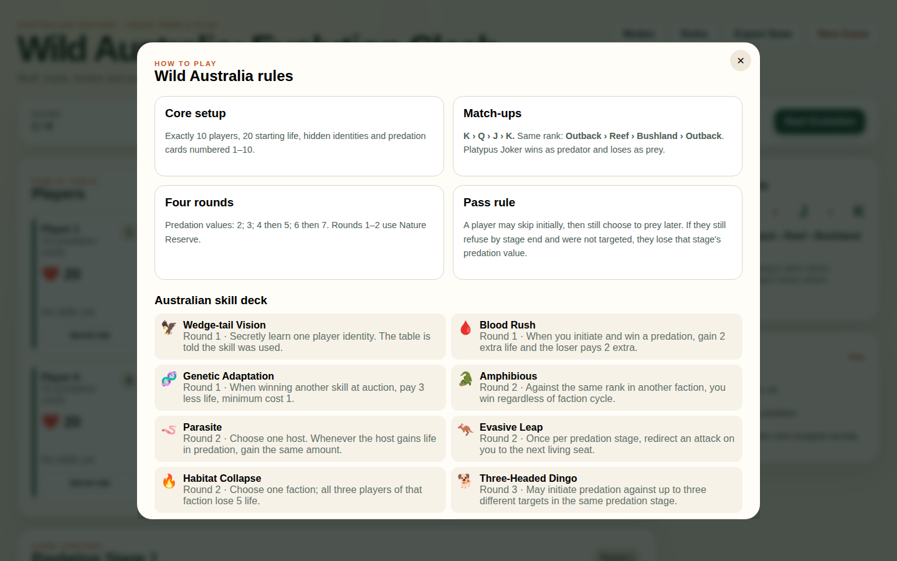

# 🇦🇺 Wild Australia: Evolution Clash

A browser-based Australian social strategy game with **Solo vs AI**, **Online Multiplayer foundation**, and **Local Pass & Play** modes.

🎮 **[Open the live game](https://cliffer1999.github.io/1/)**

- 🤖 **[Solo vs AI](https://cliffer1999.github.io/1/solo.html)** — playable now: 1 human + 9 AI
- 📱 **[Local Pass & Play](https://cliffer1999.github.io/1/local.html)** — playable now: 10 people sharing one device
- 🌐 **[Online Multiplayer](https://cliffer1999.github.io/1/online.html)** — room/chat client and Supabase schema implemented; live backend connection still required before real rooms can be used

## Screenshots

### Game mode selection


### Solo vs AI


<details>
<summary>More screenshots</summary>

### Local predation dashboard


### Rules & Australian skill deck


</details>

The project takes the supplied **Forest Evolution / Forest Battle** ruleset as its mechanical base and localises the presentation around three Australian habitats: **Outback**, **Great Barrier Reef** and **Bushland**. Core mechanics such as secret identities, life points, numbered predation cards, cyclic match-ups, four rounds, discussion/free phases, predation, evolution auctions and the supplied skill effects are retained.

> This repository is an independent game prototype. It is not affiliated with the original television programme, production company or rights holders. The Australian names, interface and artwork treatment in this repository are original to this adaptation.

## Game modes

### 🤖 Solo vs AI — playable

Solo mode is designed so one person can experience the game without assembling a 10-player group.

- You control Seat 1 and receive one private hidden identity.
- Nine AI-controlled rivals occupy the other seats.
- AI players generate table-talk during the discussion/free phase without revealing their hidden identities.
- You can bluff in chat, negotiate life and card trades, and use free-phase abilities.
- You choose your own predation targets; AI players choose legal targets, attack or pass using the same core rules engine.
- Evolution skills are auctioned using life. You set your maximum bid while AI opponents submit competing bids.
- The complete state machine runs through all four rounds to Final Standings.
- Solo progress autosaves locally in the browser.

The AI is intentionally lightweight and deterministic-rule-driven rather than presented as human-level strategic intelligence. Its purpose is to make the complete design immediately playable and testable by one person.

### 🌐 Online Multiplayer — backend connection pending

The online client is structured for **10 players on separate devices** with the discussion phase preserved as real room chat.

Implemented in the repository:

- six-character room-code UI
- create/join room client
- 10-seat lobby
- anonymous player-session flow
- realtime room-player and chat subscriptions
- room discussion chat
- host start control when all 10 seats are occupied
- private-secret data model with Row Level Security design
- Supabase SQL schema for `rooms`, `room_players`, `player_secrets` and `messages`

The published site currently keeps Create/Join disabled when Supabase credentials are not configured. **Authoritative online role assignment and synchronized predation/evolution actions are not yet claimed as complete.** This avoids presenting a local simulation as working multiplayer.

### 📱 Local Pass & Play — playable

The original tested digital-tabletop mode remains available. Exactly 10 people share one phone, tablet or computer, pass the device around for private identity checks, discuss face-to-face, and use the public dashboard as the game referee/state tracker.

## Australian edition

### Identities

- 🦘 Outback K / Q / J
- 🐠 Great Barrier Reef K / Q / J
- 🌿 Bushland K / Q / J
- 🦆 Platypus Joker

Match-ups preserve the cyclic structure:

```text
K > Q > J > K
Outback > Reef > Bushland > Outback  (same rank only)
```

Platypus Joker wins whenever it is the predator and loses whenever it is the prey.

### Rounds

| Round | Predation stakes | Nature Reserve |
|---|---:|---|
| 1 | 2 | Yes |
| 2 | 3 | Yes |
| 3 | 4, then 5 | No |
| 4 | 6, then 7 | No |

Each round follows:

```text
Discussion / Free Phase → Predation Phase(s) → Evolution Phase
```

A player may initially pass during a Predation stage and still decide to attack later. If the player is still marked as passing when the stage ends **and was not targeted by another player during that stage**, the game deducts that stage's predation value from their life.

### Australian-localised skill deck

The 17 supplied skills are implemented with localised names, including **Wedge-tail Vision**, **Three-Headed Dingo**, **Dingo Pack Leader**, **Echidna Spines**, **Inland Taipan Venom**, **Bushland Sceptre**, **Tail Drop** and **Torpor**.

## Implemented core systems

- Secret random identity assignment for exactly 10 seats
- Public life, skill, card-count and status board
- Cyclic K/Q/J and habitat combat resolution
- Platypus Joker special rule
- Predation cards 1–10 and card consumption
- Free-phase life and predation-card trading
- 10-life received-trade cap per round
- Round-based predation values (2 / 3 / 4+5 / 6+7)
- Pass / reconsider / automatic refusal-penalty workflow
- Nature Reserve protection in Rounds 1–2
- Two predation stages in Rounds 3–4
- Evolution skill auctions using life bids
- all 17 supplied skill effects
- elimination bonus (+3 life + eliminated player's remaining predation cards)
- responsive desktop / tablet / mobile UI

## Testing

The game rules are separated from the browser interfaces and run through automated CI.

```bash
npm install
npm run check
npx playwright install chromium
npm run test:e2e
```

Current verified CI coverage:

- **41 Node tests passed** — 35 core engine tests + 6 Solo AI tests
- **7 Chromium browser tests passed**
- browser coverage includes the Mode Select page, Local gameplay, pass penalties, the complete four-round Local state machine, the 17-skill rules view, Solo discussion, the complete four-round Solo state machine, and the safe Online-backend-not-configured state
- automated real-browser portfolio screenshot generation also passes

GitHub Actions runs syntax, engine/AI tests and Chromium browser gameplay tests on pushes. GitHub Pages automatically deploys the multi-mode static site.

## Technical notes

- Vanilla HTML / CSS / JavaScript
- Shared ES-module rules engine
- Rule-driven Solo AI layer
- `localStorage` Solo/Local autosave
- Node `node:test`
- Playwright Chromium end-to-end tests
- GitHub Actions CI
- GitHub Pages automated deployment
- Supabase Realtime client + SQL/RLS multiplayer foundation

## Portfolio angle

This project demonstrates translating a detailed social-game rules specification into a working state machine, preserving a negotiation/discussion phase across different play modes, handling edge cases and interacting abilities, adding a playable AI simulation, designing a realtime multiplayer data model, writing automated unit/browser tests, and shipping the result as a browser application.

## Licence

Code in this repository is released under the MIT License. The supplied source rules remain the responsibility of their respective rights holders; this repository only contains the independent Australian-themed implementation and explanatory summary needed to operate the prototype.
